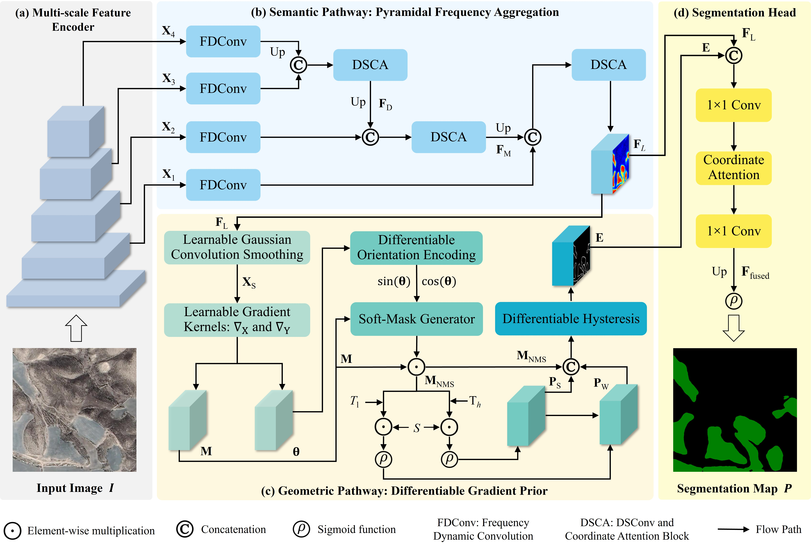

# GMLNet: A Lightweight Frequency-Gradient Framework for Gravel-Mulched Land Segmentation in High-Resolution Optical Imagery
For more ore information, please see our published paper at [Expert Systems with Applications](https://doi.org/10.1016/j.eswa.2026.133300).

# Requirements
Python 3.10  
pytorch 1.12.1  
CUDA 11.3
# DIPFNet code
DIPFNet Link: https://github.com/zjd1836/DIPFNet/blob/main/DIPFNet.py
# GZ-UAV-BCD dataset
GZ-UAV-BCD Link: https://pan.baidu.com/s/1PsR4cz-xxyNvk0AGyfdkWw?pwd=xtre Extraction Code: xtre
# Citation
If you use this code or dataset for your research, please cite our paper:  
